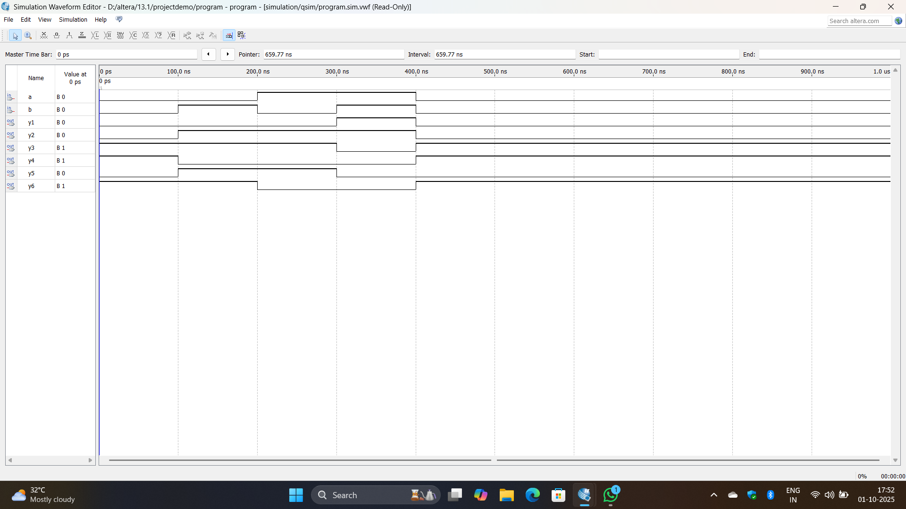
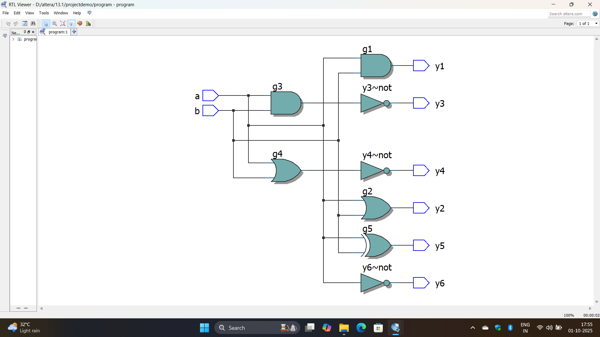

# My First Quartus II 13.1 Project 🚀

> First project using **Intel Quartus II 13.1**. Implemented basic logic gates in Verilog and verified outputs with waveform simulation.

## Project Overview

This project demonstrates the implementation of basic digital logic gates using **Verilog HDL** in **Intel Quartus II 13.1**.  

The functionality of each gate is verified using waveform simulation, and a logic gate diagram is included for reference.

### Logic Gates Implemented

- AND  
- OR  
- NAND  
- NOR  
- XOR  
- NOT  

### Features

- Verilog implementation of each logic gate  
- Waveform simulation to verify outputs  
- Logic gate diagram for visual reference  

## Screenshots

### Waveform Simulation


### Logic Gate Diagram


## How to Run

1. Clone the repository:  
```bash
git clone https://github.com/your-username/first-quartus-project.git
